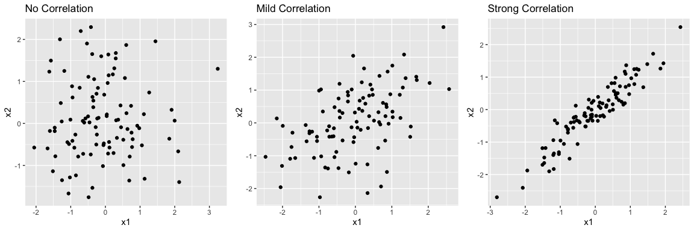

# Experimental Design Example


## Setup

``` r
suppressWarnings(suppressPackageStartupMessages({
library(MASS)
library(ggplot2)
library(glmnet)
library(dplyr)
library(tidyr)
library(gridExtra)
library(kableExtra)
}))

library(MASS)
library(ggplot2)
library(glmnet)
library(dplyr)
library(tidyr)
library(gridExtra)
library(kableExtra)
```

## Data Simulation

We simulate three datasets: 1. No multicollinearity (x1 and x2
independent) 2. Mild multicollinearity (correlation = 0.5) 3. Strong
multicollinearity (correlation = 0.95)

``` r
set.seed(123)
n <- 100
b0 <- 5
b1 <- 3
b2 <- -2
noise <- rnorm(n)

simulate_data <- function(correlation) {
  x1 <- rnorm(n)
  x2 <- correlation * x1 + sqrt(1 - correlation^2) * rnorm(n)
  y <- b0 + b1 * x1 + b2 * x2 + noise
  data.frame(x1 = x1, x2 = x2, y = y)
}

df_none <- simulate_data(0.0)
df_mild <- simulate_data(0.5)
df_strong <- simulate_data(0.95)
```

## Visualizing Correlation

``` r
plot_list <- list(
  ggplot(df_none, aes(x = x1, y = x2)) + geom_point() + ggtitle("No Correlation"),
  ggplot(df_mild, aes(x = x1, y = x2)) + geom_point() + ggtitle("Mild Correlation"),
  ggplot(df_strong, aes(x = x1, y = x2)) + geom_point() + ggtitle("Strong Correlation")
)
grid.arrange(grobs = plot_list, ncol = 3)
```

<figure>

<figcaption aria-hidden="true">Scatterplots showing increasing
correlation between x1 and x2</figcaption>
</figure>

## Modeling Function

``` r
fit_models <- function(df) {
  X <- as.matrix(df[, c("x1", "x2")])
  y <- df$y

  lm_fit <- lm(y ~ x1 + x2, data = df)
  ridge_fit <- glmnet(X, y, alpha = 0, lambda = 1)
  lasso_fit <- glmnet(X, y, alpha = 1, lambda = 0.1)

  results <- tibble(
    Model = c("Linear", "Ridge", "Lasso"),
    bias_b1 = c(coef(lm_fit)["x1"]-b1, coef(ridge_fit)[2]-b1, coef(lasso_fit)[2]-b1),
    bias_b2 = c(coef(lm_fit)["x2"]-b2, coef(ridge_fit)[3]-b2, coef(lasso_fit)[3]-b2),
    MSE = c(mean((predict(lm_fit) - y)^2),
            mean((predict(ridge_fit, X) - y)^2),
            mean((predict(lasso_fit, X) - y)^2))
  )
  return(results)
}
```

## Results for Each Scenario

``` r
res_none <- fit_models(df_none) %>% mutate(Scenario = "None")
res_mild <- fit_models(df_mild) %>% mutate(Scenario = "Mild")
res_strong <- fit_models(df_strong) %>% mutate(Scenario = "Strong")

results <- bind_rows(res_none, res_mild, res_strong)
kable(results %>% pivot_wider(names_from = Model, values_from = c(bias_b1, bias_b2, MSE)))
```

<table>
<colgroup>
<col style="width: 7%" />
<col style="width: 11%" />
<col style="width: 11%" />
<col style="width: 11%" />
<col style="width: 11%" />
<col style="width: 11%" />
<col style="width: 11%" />
<col style="width: 8%" />
<col style="width: 7%" />
<col style="width: 7%" />
</colgroup>
<thead>
<tr class="header">
<th style="text-align: left;">Scenario</th>
<th style="text-align: right;">bias_b1_Linear</th>
<th style="text-align: right;">bias_b1_Ridge</th>
<th style="text-align: right;">bias_b1_Lasso</th>
<th style="text-align: right;">bias_b2_Linear</th>
<th style="text-align: right;">bias_b2_Ridge</th>
<th style="text-align: right;">bias_b2_Lasso</th>
<th style="text-align: right;">MSE_Linear</th>
<th style="text-align: right;">MSE_Ridge</th>
<th style="text-align: right;">MSE_Lasso</th>
</tr>
</thead>
<tbody>
<tr class="odd">
<td style="text-align: left;">None</td>
<td style="text-align: right;">-0.0430688</td>
<td style="text-align: right;">-0.7047242</td>
<td style="text-align: right;">-0.1502823</td>
<td style="text-align: right;">-0.1227950</td>
<td style="text-align: right;">0.3601536</td>
<td style="text-align: right;">-0.0136505</td>
<td style="text-align: right;">0.8094203</td>
<td style="text-align: right;">1.405255</td>
<td style="text-align: right;">0.8300512</td>
</tr>
<tr class="even">
<td style="text-align: left;">Mild</td>
<td style="text-align: right;">0.0611348</td>
<td style="text-align: right;">-1.0839873</td>
<td style="text-align: right;">-0.1348920</td>
<td style="text-align: right;">-0.2062915</td>
<td style="text-align: right;">0.8073176</td>
<td style="text-align: right;">-0.0013341</td>
<td style="text-align: right;">0.7923810</td>
<td style="text-align: right;">1.996287</td>
<td style="text-align: right;">0.8329100</td>
</tr>
<tr class="odd">
<td style="text-align: left;">Strong</td>
<td style="text-align: right;">0.0457959</td>
<td style="text-align: right;">-2.4220777</td>
<td style="text-align: right;">-1.6990046</td>
<td style="text-align: right;">-0.1085504</td>
<td style="text-align: right;">2.1412218</td>
<td style="text-align: right;">1.6560632</td>
<td style="text-align: right;">0.8210712</td>
<td style="text-align: right;">1.461668</td>
<td style="text-align: right;">1.1475948</td>
</tr>
</tbody>
</table>

## What we should observe (according to theory)

-   In the **no correlation** case, all methods yield similar
    coefficients and MSE.
-   As multicollinearity increases, **Linear Regression** coefficients
    become unstable.
-   **Ridge** regression shrinks coefficients and handles
    multicollinearity better.
-   **Lasso** may set some coefficients to zero depending on the penalty
    strength.

## How do we know which numbers are statistically different?

-   We need repetitions!
