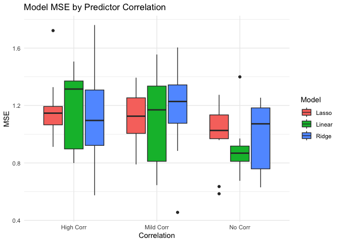
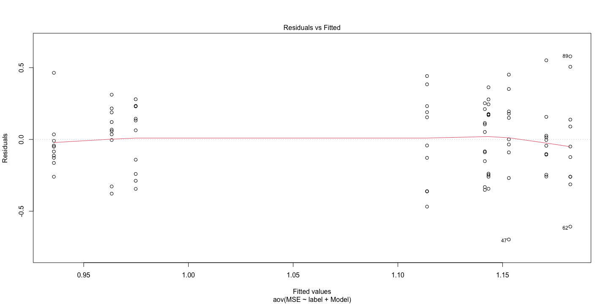
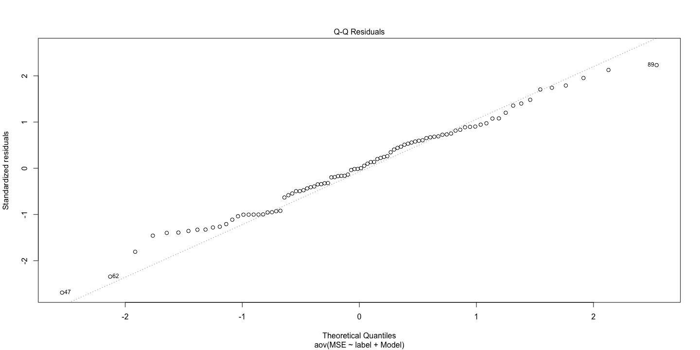
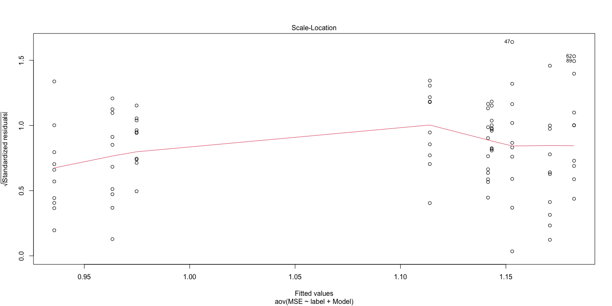
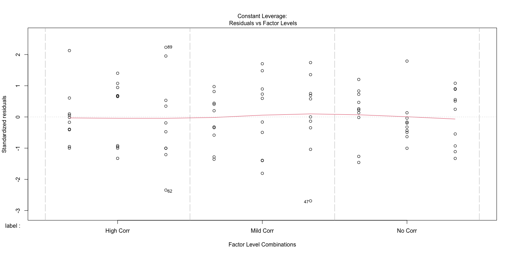
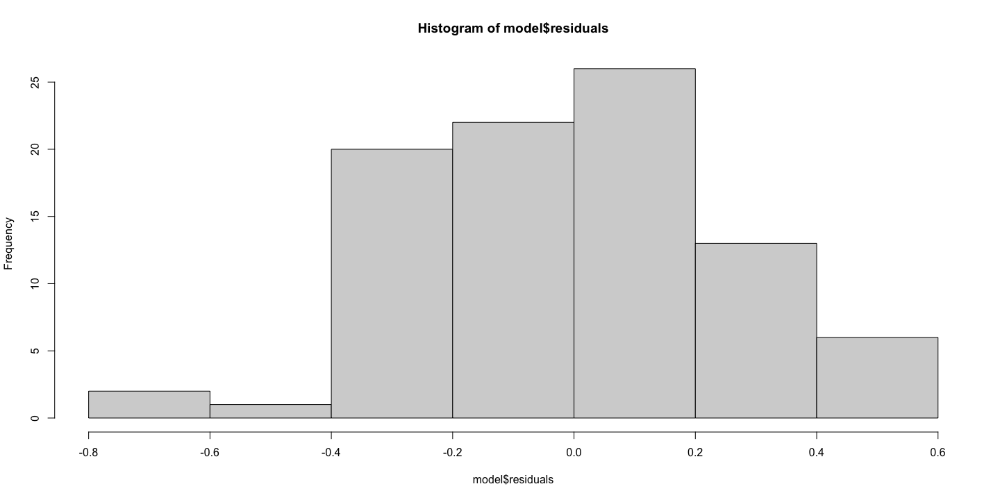
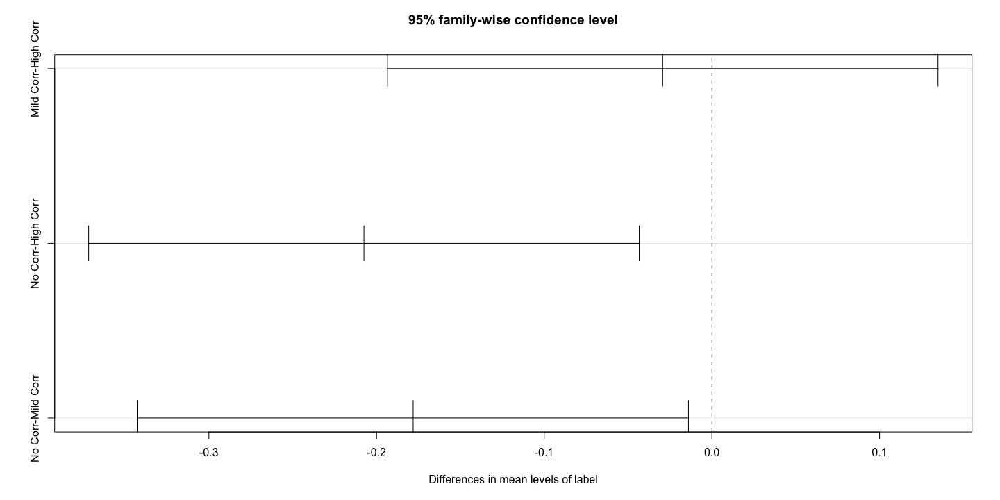
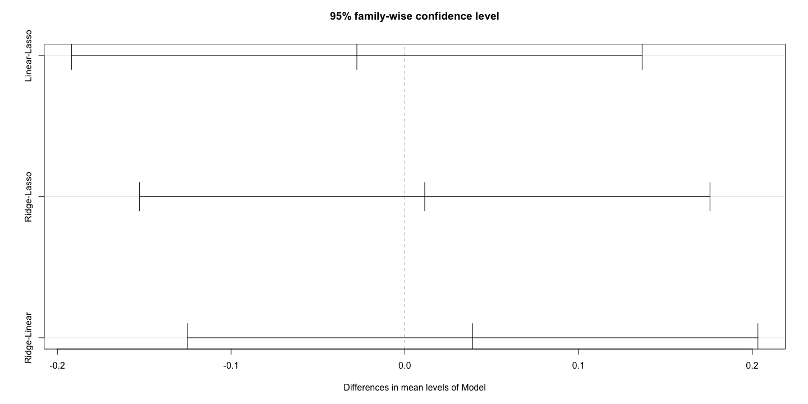

# Monte Carlo Simulation: Comparing Linear, Ridge, and Lasso Regression


## Objective

This Monte Carlo simulation compares the performance of three regression
models: - Linear Regression - Ridge Regression - Lasso Regression

We simulate 30 datasets: - 10 datasets with no correlation between
predictors *x*<sub>1</sub> and *x*<sub>2</sub> - 10 datasets with mild
correlation - 10 datasets with high correlation

Models are evaluated using Mean Squared Error (MSE), and results are
summarized by mean and standard deviation of MSE.

## Setup

``` r
library(tidyverse)
```

    ── Attaching core tidyverse packages ──────────────────────── tidyverse 2.0.0 ──
    ✔ dplyr     1.1.4     ✔ readr     2.1.5
    ✔ forcats   1.0.0     ✔ stringr   1.5.1
    ✔ ggplot2   3.5.2     ✔ tibble    3.2.1
    ✔ lubridate 1.9.4     ✔ tidyr     1.3.1
    ✔ purrr     1.0.4     
    ── Conflicts ────────────────────────────────────────── tidyverse_conflicts() ──
    ✖ dplyr::filter() masks stats::filter()
    ✖ dplyr::lag()    masks stats::lag()
    ℹ Use the conflicted package (<http://conflicted.r-lib.org/>) to force all conflicts to become errors

``` r
library(glmnet)
```

    Loading required package: Matrix

    Attaching package: 'Matrix'

    The following objects are masked from 'package:tidyr':

        expand, pack, unpack

    Loaded glmnet 4.1-8

``` r
library(broom)
set.seed(111)
```

## Data Generation Function

``` r
generate_data <- function(n = 100, correlation = 0.0) {
  sigma <- matrix(c(1, correlation, correlation, 1), nrow = 2)
  predictors <- mvtnorm::rmvnorm(n, mean = c(0, 0), sigma = sigma, method = "eigen")
  x1 <- predictors[, 1]
  x2 <- predictors[, 2]
  noise <- rnorm(n)
  y <- 0 * x1 + 4 * x2 + noise
  tibble(x1 = x1, x2 = x2, y = y)
}
```

## Simulation Loop with `map`

``` r
correlations <- tibble(
  label = c("No Corr", "Mild Corr", "High Corr"),
  rho = c(0.0, 0.5, 0.99)
)

models <- c("Linear", "Ridge", "Lasso")

simulate_one <- function(df, model_name) {
  split <- initial_split(df, prop = 0.7)
  train <- training(split)
  test <- testing(split)
  x_train <- as.matrix(select(train, x1, x2))
  x_test <- as.matrix(select(test, x1, x2))
  y_train <- train$y
  y_test <- test$y

  fit <- switch(model_name,
    "Linear" = lm(y ~ x1 + x2, data = train),
    "Ridge" = glmnet(x_train, y_train, alpha = 0, lambda = 0.1),
    "Lasso" = glmnet(x_train, y_train, alpha = 1, lambda = 0.1)
  )

  preds <- if (model_name == "Linear") {
    predict(fit, newdata = test)
  } else {
    predict(fit, newx = x_test, s = ifelse(model_name == "Ridge", 1, 0.1))
  }

  mse <- mean((y_test - preds)^2)
  tibble(Model = model_name, MSE = mse)
}

library(rsample)

# Run models on each dataset
results <- correlations %>%
  mutate(simulations = map(rho, ~ replicate(10, generate_data(correlation = .x), simplify = FALSE))) %>%
  unnest(simulations) %>%
  mutate(results = map(simulations, ~ map_dfr(models, function(model) simulate_one(., model)))) %>%
  unnest(results)
```

## Summary Table

``` r
summary <- results %>%
  group_by(Model, label) %>%
  summarise(
    Mean_MSE = mean(MSE),
    SD_MSE = sd(MSE),
    .groups = 'drop'
  )

summary
```

    # A tibble: 9 × 4
      Model  label     Mean_MSE SD_MSE
      <chr>  <chr>        <dbl>  <dbl>
    1 Lasso  High Corr    1.17   0.231
    2 Lasso  Mild Corr    1.11   0.211
    3 Lasso  No Corr      0.992  0.222
    4 Linear High Corr    1.17   0.269
    5 Linear Mild Corr    1.12   0.326
    6 Linear No Corr      0.900  0.194
    7 Ridge  High Corr    1.15   0.369
    8 Ridge  Mild Corr    1.18   0.330
    9 Ridge  No Corr      0.982  0.237

## Visualization (Optional)

``` r
ggplot(results, aes(x = label, y = MSE, fill = Model)) +
  geom_boxplot() +
  labs(title = "Model MSE by Predictor Correlation", x = "Correlation", y = "MSE") +
  theme_minimal()
```



## Statistical comparison of results

``` r
alpha <- 0.05

# Fit the ANOVA model
model <- aov(MSE ~ label + Model, data = results)

plot(model)
```









``` r
hist(model$residuals)
```



``` r
# Perform Tukey's HSD for multiple comparisons with alpha 
tukey_results <- TukeyHSD(model, conf.level = 1 - alpha) 

# View the results
plot(tukey_results)
```





What if we don’t have normal residuals?

``` r
# Kruskal-Wallis for 'label'
kruskal.test(MSE ~ label, data = results)
```


        Kruskal-Wallis rank sum test

    data:  MSE by label
    Kruskal-Wallis chi-squared = 10.002, df = 2, p-value = 0.006732

``` r
# Kruskal-Wallis for 'Model'
kruskal.test(MSE ~ Model, data = results)
```


        Kruskal-Wallis rank sum test

    data:  MSE by Model
    Kruskal-Wallis chi-squared = 0.38769, df = 2, p-value = 0.8238

``` r
# OR install https://github.com/cran/ARTool

# Pairwise comparisons for 'label'
pairwise.wilcox.test(results$MSE, results$label, p.adjust.method = "holm")
```


        Pairwise comparisons using Wilcoxon rank sum exact test 

    data:  results$MSE and results$label 

              High Corr Mild Corr
    Mild Corr 0.866     -        
    No Corr   0.014     0.015    

    P value adjustment method: holm 
